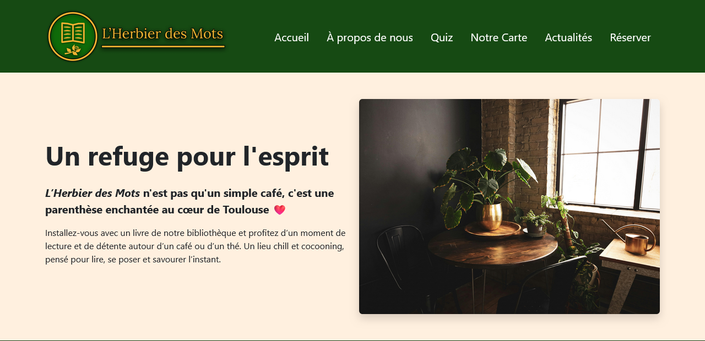
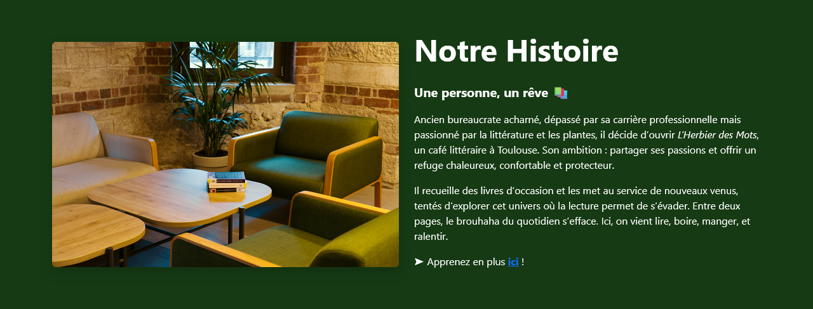
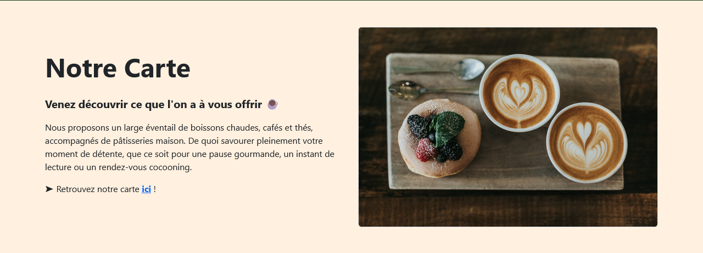
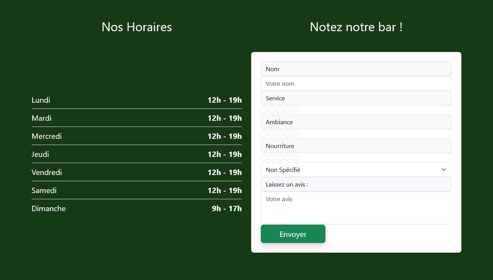
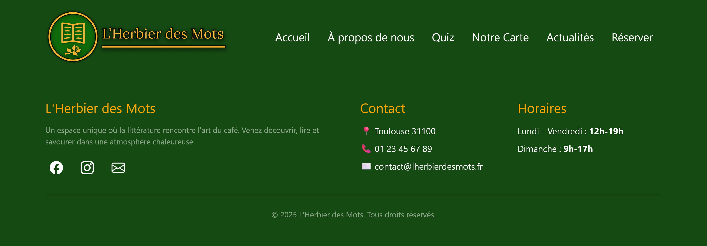

# 🪴 L'Herbier des Mots – Projet de Bar Fictif

L’Herbier des Mots est un site web fictif développé dans le cadre de ma formation en **BTS SIO**.

Il représente la vitrine d’un bar à ambiance littéraire, où les utilisateurs peuvent consulter les boissons disponibles et laisser leurs avis.
Le projet inclut la gestion des avis clients et une architecture web complète, sécurisée et modulable.

---

## 🎯 Objectifs pédagogiques

- Mettre en pratique une stack complète de développement web
- Comprendre la structure d’un projet PHP
- Manipuler une base de données MySQL
- Sécuriser les requêtes avec PDO
- Organiser un projet web de manière modulaire
- Gérer des formulaires utilisateurs

---

## 🛠️ Technologies utilisées

- **PHP** – côté serveur
- **MySQL** – base de données
- **PDO** – connexion sécurisée
- **HTML5** – structure des pages
- **CSS3** – style et mise en page
- **Bootstrap** – responsive et composants
- **JavaScript** – interactions dynamiques

---

## 🗂️ Structure du projet

- /assets
  - /css
  - /images
    - /quizz
    - /preview
- /config
  - database.php
- /includes
  - footer.php
  - form.php
  - header.php
- /public
  - /js
    - script.js
  - /pages
    - about.php
    - menu.php
    - news.php
    - quiz.php
    - reservation.php
  - index.php
- README.md

## ✨ Fonctionnalités principales

- Consultation et ajout d’avis clients
- Formulaires sécurisés avec validation côté serveur
- Architecture modulable avec `header.php`, `footer.php`, `form.php`
- Fichier `database.php` hors du dossier public pour protéger les identifiants
- Design responsive grâce à Bootstrap

## ⚙️ Installation en local

1. Cloner le repository : `git clone https://github.com/maillet-nills/L-Herbier-des-Mots---Projet-de-Bar-fictif---BTS-SIO.git`
2. Importer la base de données dans phpMyAdmin
3. Configurer les identifiants dans `database.php`
4. Lancer le projet via XAMPP ou WAMP
5. Accéder au site depuis `localhost`

---

## 📸 Captures d’écran

### Page d'accueil - Header

### Contenu principal

### Horaires & Formulaire

### Footer

Pour voir la page complète : [Capture complète](assets/images/preview/capture_page_complete.png)

---

## 👨‍💻 Auteur

Maillet Nills  
Étudiant en BTS SIO – Développement
